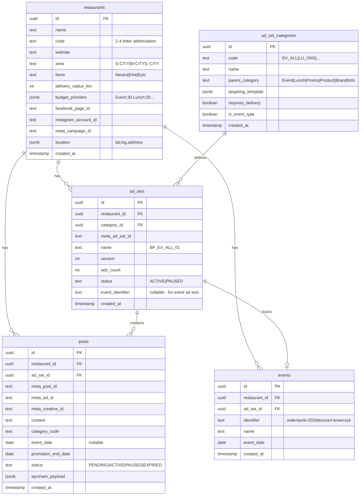
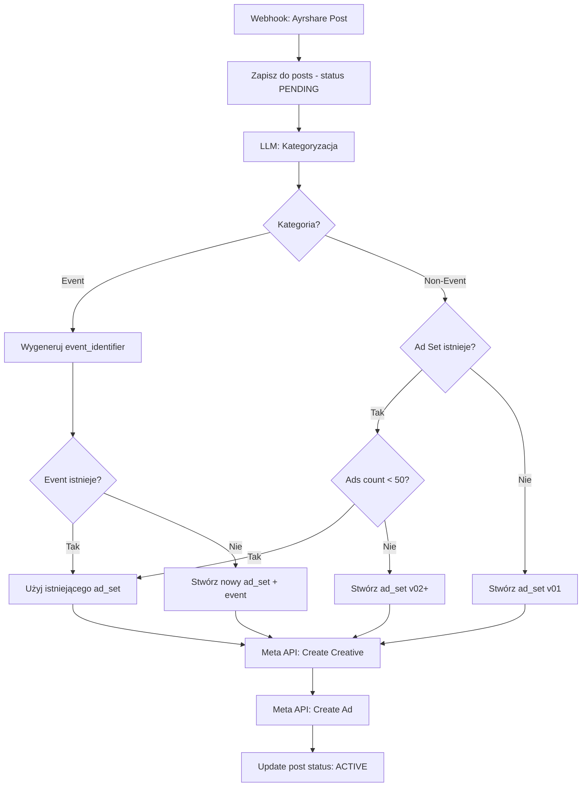

# Meta Ads Autopilot - Plan Architektury

## Struktura Projektu

```
meta-ads-autopilot/
├── packages/
│   ├── api/                 # NestJS API
│   │   ├── src/
│   │   │   ├── modules/
│   │   │   │   ├── restaurants/
│   │   │   │   ├── campaigns/
│   │   │   │   ├── ad-sets/
│   │   │   │   ├── ads/
│   │   │   │   ├── posts/
│   │   │   │   ├── webhook/
│   │   │   │   └── scheduler/
│   │   │   ├── services/
│   │   │   │   ├── meta-api.service.ts
│   │   │   │   ├── llm.service.ts
│   │   │   │   └── supabase.service.ts
│   │   │   └── main.ts
│   │   └── package.json
│   └── app/                 # React + Vite
│       ├── src/
│       │   ├── pages/
│       │   │   ├── Dashboard.tsx
│       │   │   ├── Restaurants.tsx
│       │   │   └── AdSetConfig.tsx
│       │   └── components/
│       └── package.json
├── package.json             # Workspace root
└── vercel.json
```

## Schemat Bazy Danych (Supabase)



## Flow Przetwarzania Postów



## Kluczowe Komponenty

### 1. Meta API Service

Bezpośrednie wywołania Graph API (bez SDK):

- `createCampaign(restaurantName)` - OUTCOME_ENGAGEMENT objective
- `createAdSet(campaignId, name, targeting, dailyBudget)`
- `createCreative(pageId, postId)` - użycie istniejącego posta
- `createAd(adSetId, creativeId, name)`
- `updateAdStatus(adId, status)` - ACTIVE/PAUSED
- `getAudienceSize(targeting)` - estimated reach

### 2. LLM Service (OpenRouter)

Prompt do kategoryzacji:

```
Analizujesz post restauracji. Wyciągnij:
1. category: jedno z [EV_ALL|EV_FAM|EV_PAR|EV_SEN|LU_ONS|LU_DEL|PR_ONS_CYK|PR_ONS_JED|PR_DEL_CYK|PR_DEL_JED|PD_ONS|PD_DEL|BRAND|INFO]
2. event_date: jeśli to wydarzenie (format YYYY-MM-DD)
3. event_identifier: jeśli event - krótki slug (np. "walentynki-2026")
4. promotion_end_date: sugerowana data końca promocji (max 60 dni od dziś, dla eventów = event_date)

Post: {content}
Odpowiedz jako JSON.
```

### 3. Scheduler Service

- Cron job: codziennie o 00:01
- Endpoint: `POST /api/scheduler/expire-posts` (manual trigger z UI)
- Query: `SELECT * FROM posts WHERE promotion_end_date <= TODAY AND status = 'ACTIVE'`
- Dla każdego: `updateAdStatus(meta_ad_id, 'PAUSED')`

### 4. Targeting Templates

```typescript
const targetingTemplates = {
  base: (restaurant) => ({
    geo_locations: {
      custom_locations: [{
        latitude: restaurant.location.lat,
        longitude: restaurant.location.lng,
        radius: restaurant.area === 'S-CITY' ? 5 : 
                restaurant.area === 'M-CITY' ? 10 : 15,
        distance_unit: 'kilometer'
      }]
    },
    age_min: 18,
    age_max: 65
  }),
  delivery: (restaurant) => ({
    ...base(restaurant),
    geo_locations: {
      custom_locations: [{
        ...base.geo_locations.custom_locations[0],
        radius: restaurant.delivery_radius_km
      }]
    }
  }),
  event_family: { flexible_spec: [{ interests: [{ id: '6003139266461', name: 'Family' }] }] },
  event_couple: { age_min: 21, age_max: 45, flexible_spec: [{ interests: [{ id: '6003248649975', name: 'Dating' }] }] },
  event_senior: { age_min: 55, age_max: 65 }
}
```

## UI (React)

### Strony:

1. **Dashboard** - lista restauracji + status postów
2. **Restaurant Form** - dodawanie/edycja restauracji

   - Name, Code, Website
   - Area (S/M/L-CITY), Fame
   - Location (lat/lng + adres)
   - Delivery radius
   - Facebook Page ID, Instagram Account ID
   - Budget priorities (% per kategoria)

3. **Ad Set Config** - edycja kategorii ad setów

   - Lista kategorii z targeting templates
   - Możliwość edycji targetingu per kategoria

4. **Posts Log** - historia przetworzonych postów

## Zmienne Środowiskowe

```env
# Supabase
SUPABASE_URL=
SUPABASE_SERVICE_KEY=

# Meta
META_ACCESS_TOKEN=
META_AD_ACCOUNT_ID=

# OpenRouter
OPENROUTER_API_KEY=

# App
WEBHOOK_SECRET= # dla weryfikacji Ayrshare
```

## Deployment (Vercel)

- `packages/api` -> Serverless Functions
- `packages/app` -> Static Site
- Cron job via Vercel Cron (`vercel.json`)

## Kluczowe Decyzje Techniczne

1. **Idempotencja**: Każdy post ma unikalny `meta_post_id` - zapobiega duplikatom przy retry
2. **Bullet-proof**: Posty najpierw zapisywane jako PENDING, status zmienia się po sukcesie Meta API
3. **Event isolation**: Każdy unikalny event (po `event_identifier`) = osobny ad_set
4. **50 ads limit**: Automatyczne tworzenie nowej wersji ad_set gdy limit osiągnięty
5. **Beneficiary/Payer**: Hardcoded w createCreative - Beneficiary: restaurant.name, Payer: "your_agency_name"

## Meta API - Potrzebne Permissions

Twoja Meta App musi mieć:

- `ads_management` - zarządzanie reklamami
- `pages_read_engagement` - odczyt postów
- `business_management` - dostęp do ad account