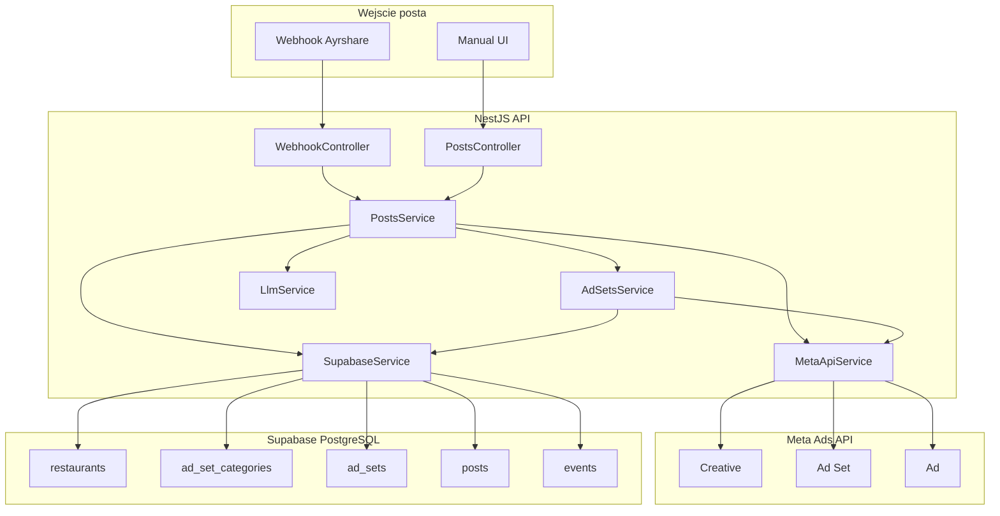
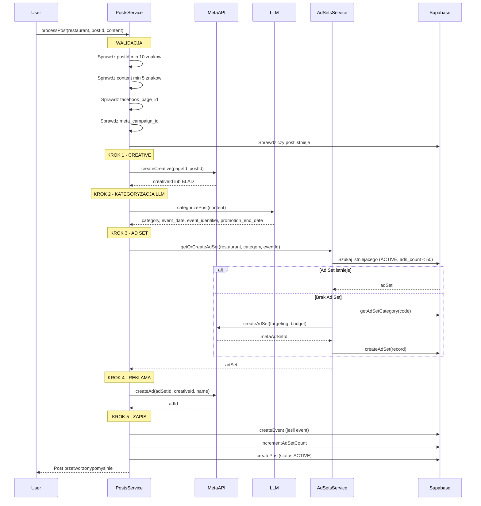

# Architektura opracowanego systemu

## Architektura systemu



---

## Kluczowy Flow: Od Posta do Reklamy



---

## Tech Stack

| Warstwa | Technologia |

|---------|-------------|

| Backend | NestJS 10.x |

| Frontend | React 18 + Vite 5 |

| Database | Supabase (PostgreSQL) |

| LLM | OpenRouter API (Claude Haiku) |

| Meta Ads | Graph API v23.0 |

| Hosting | Vercel |

| Monorepo | pnpm workspaces |

---

## Struktura projektu

```
meta-ads-autopilot/
├── packages/
│   ├── api/                    # NestJS Backend
│   │   ├── src/
│   │   │   ├── main.ts         # Bootstrap + Vercel handler
│   │   │   ├── app.module.ts   # Root module
│   │   │   ├── modules/
│   │   │   │   ├── restaurants/
│   │   │   │   ├── posts/
│   │   │   │   ├── ad-sets/
│   │   │   │   ├── webhook/
│   │   │   │   └── scheduler/
│   │   │   └── services/
│   │   │       ├── supabase.service.ts
│   │   │       ├── meta-api.service.ts
│   │   │       └── llm.service.ts
│   │   └── package.json
│   └── app/                    # React Frontend
│       ├── src/
│       │   ├── main.tsx
│       │   ├── App.tsx
│       │   ├── api.ts
│       │   ├── types.ts
│       │   ├── styles.css
│       │   └── pages/
│       │       ├── Dashboard.tsx
│       │       ├── Restaurants.tsx
│       │       ├── AdSetConfig.tsx
│       │       ├── Events.tsx
│       │       └── PostsLog.tsx
│       └── package.json
├── supabase/
│   └── schema.sql
├── vercel.json
├── pnpm-workspace.yaml
└── package.json
```

---

## Faza 1: Infrastruktura

### 1.1 Inicjalizacja monorepo

- Utworzenie `package.json` z workspace scripts
- Utworzenie `pnpm-workspace.yaml`
- Konfiguracja `vercel.json` (builds, routes, crons)

### 1.2 Schemat bazy danych ([schema.sql](supabase/schema.sql))

5 tabel z relacjami:

| Tabela | Opis | Kluczowe pola |

|--------|------|---------------|

| `restaurants` | Restauracje | facebook_page_id, meta_campaign_id, location, area, delivery_radius_km |

| `ad_set_categories` | 14 kategorii | code, targeting_template, requires_delivery, is_event_type |

| `ad_sets` | Utworzone ad sety | restaurant_id, category_id, meta_ad_set_id, ads_count (max 50), version |

| `posts` | Posty/reklamy | meta_post_id, meta_ad_id, meta_creative_id, category_code, promotion_end_date, status |

| `events` | Kalendarz wydarzen | identifier, event_date, ad_set_id |

Funkcja SQL: `increment_ad_set_count(ad_set_id)` - atomowa inkrementacja licznika

---

## Faza 2: Backend API (NestJS)

### 2.1 Core Services

**SupabaseService** - wrapper na Supabase client z cachowaniem (30s TTL):

- CRUD dla wszystkich tabel
- `getAdSetForCategory()` - szukanie ad setu (ACTIVE, ads_count < 50)
- `getExpiredPosts()` - posty do wygaszenia
- `getNextAdSetVersion()` - kolejny numer wersji

**MetaApiService** - integracja z Graph API v23.0:

- `createCampaign()` - cel OUTCOME_TRAFFIC
- `createAdSet()` - LINK_CLICKS, LOWEST_COST_WITHOUT_CAP
- `createCreative()` - object_story_id + CTA Learn More
- `createAd()` - polaczenie ad set + creative
- `buildTargeting()` - geo_locations, age, genders, interests

**LlmService** - kategoryzacja tresc i posta:

- Model: `anthropic/claude-3-haiku` via OpenRouter
- Zwraca: `{ category, event_date, event_identifier, promotion_end_date }`
- Walidacja kategorii (14 dozwolonych)
- Fallback na INFO przy bledzie

### 2.2 Moduly biznesowe

**PostsModule** - KLUCZOWA LOGIKA:

```typescript
async processPost(params):
  1. WALIDACJA: postId, content, page_id, campaign_id, duplikat
  2. CREATIVE: metaApi.createCreative() - PIERWSZY! (waliduje czy post moze byc promowany)
  3. LLM: llm.categorizePost(content)
  4. AD SET: adSets.getOrCreateAdSet()
  5. AD: metaApi.createAd()
  6. ZAPIS: event (opcjonalnie), incrementCount, createPost(ACTIVE)
```

**AdSetsModule**:

- Zarzadzanie kategoriami (targeting templates)
- `getOrCreateAdSet()` - logika tworzenia nowych ad setow z wersjonowaniem
- Targeting na podstawie: area (S/M/L-CITY), delivery_radius, category template

**WebhookModule**:

- Endpoint `POST /api/webhook/ayrshare`
- Parsowanie payloadu Ayrshare (postIds, content, refId=pageId)
- Delegacja do PostsService

**SchedulerModule**:

- Cron `1 0 * * *` (00:01 codziennie)
- Wygaszanie: status ACTIVE + promotion_end_date <= today
- Pauzowanie w Meta + update status na EXPIRED

### 2.3 API Endpoints

| Endpoint | Metoda | Opis |

|----------|--------|------|

| `/api/restaurants` | GET, POST | Lista/dodaj restauracje |

| `/api/restaurants/:id` | GET, PUT, DELETE | CRUD pojedynczej |

| `/api/restaurants/:id/retry-campaign` | POST | Ponow tworzenie kampanii |

| `/api/ad-sets` | GET | Lista ad setow |

| `/api/ad-sets/:id` | DELETE | Usun ad set + reklamy |

| `/api/ad-sets/categories` | GET | Lista kategorii |

| `/api/ad-sets/categories/:id` | PUT | Update targeting template |

| `/api/ad-sets/events` | GET | Lista wydarzen |

| `/api/posts` | GET | Lista postow |

| `/api/posts/manual` | POST | Reczne dodanie posta |

| `/api/posts/:id/pause` | POST | Pauzuj reklame |

| `/api/posts/:id/activate` | POST | Aktywuj reklame |

| `/api/posts/:id/retry` | POST | Ponow przetwarzanie |

| `/api/posts/:id` | DELETE | Usun post + reklame z Meta |

| `/api/webhook/ayrshare` | POST | Webhook z Ayrshare |

| `/api/scheduler/expire-posts` | POST | Trigger wygaszania |

---

## Faza 3: Frontend (React + Vite)

### 3.1 Strony

| Strona | Funkcjonalnosc |

|--------|----------------|

| Dashboard | Statystyki (restauracje, ad sety, reklamy, aktywne) + lista restauracji z akcjami |

| Restaurants | CRUD restauracji, formularz z wszystkimi polami |

| AdSetConfig | Edycja targeting templates dla kategorii + lista aktywnych ad setow |

| Events | Kalendarz wydarzen (nadchodzace/przeszle), powiazania z ad setami |

| PostsLog | Lista reklam, reczne dodawanie, pause/activate/retry/delete |

### 3.2 API Client ([api.ts](packages/app/src/api.ts))

Wrapper fetch z obsluga bledow, wszystkie endpointy

### 3.3 Typy ([types.ts](packages/app/src/types.ts))

- Restaurant, AdSet, AdSetCategory, Post, Event
- TargetingTemplate (age_min/max, genders, interests)
- RESTAURANT_INTERESTS - predefiniowane zainteresowania Meta

---

## Faza 4: Konfiguracja i Deploy

### 4.1 Zmienne srodowiskowe

```
SUPABASE_URL, SUPABASE_SERVICE_KEY
META_ACCESS_TOKEN, META_AD_ACCOUNT_ID
OPENROUTER_API_KEY
WEBHOOK_SECRET (opcjonalne)
AGENCY_NAME
```

### 4.2 Vercel

- Frontend: `@vercel/static-build`
- API: `@vercel/node` (serverless)
- Cron: `/api/scheduler/expire-posts` o 00:01

---

## Konwencje nazewnictwa

| Element | Format | Przyklad |

|---------|--------|----------|

| Kampania | `{restaurant_name}` | `Burger Factory` |

| Ad Set | `{code}_{category}_{version}` | `BF_EV_ALL_01` |

| Reklama | `{adset}_{postId6}_{DDMMYY}` | `BF_EV_ALL_01_149400_120126` |

---

## 14 Kategorii Ad Setow

| Kod | Nazwa | Delivery | Event |

|-----|-------|----------|-------|

| EV_ALL | Event > Wszyscy | - | tak |

| EV_FAM | Event > Rodzina | - | tak |

| EV_PAR | Event > Para | - | tak |

| EV_SEN | Event > Senior | - | tak |

| LU_ONS | Lunch > On-site | - | - |

| LU_DEL | Lunch > Delivery | tak | - |

| PR_ONS_CYK | Promo > On-site > Cykliczna | - | - |

| PR_ONS_JED | Promo > On-site > Jednorazowa | - | - |

| PR_DEL_CYK | Promo > Delivery > Cykliczna | tak | - |

| PR_DEL_JED | Promo > Delivery > Jednorazowa | tak | - |

| PD_ONS | Product > On-site | - | - |

| PD_DEL | Product > Delivery | tak | - |

| BRAND | Brand | - | - |

| INFO | Info | - | - |